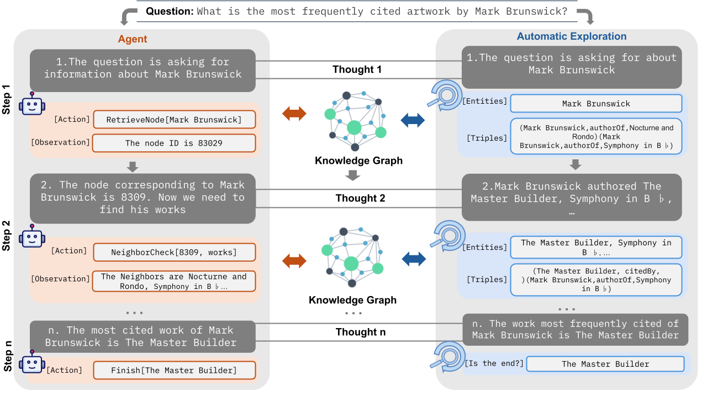
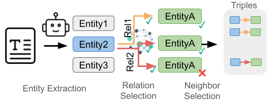
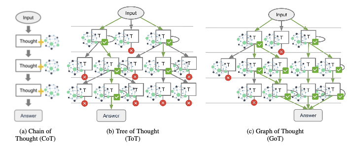

In the rapidly evolving landscape of artificial intelligence, the integration of LLMs with Knowledge Graphs (KGs) is emerging as a transparency approach to ground reasoning capabilities. This blog post explores the significance of this integration, the methodologies involved in our work, and the potential it unlocks for various applications.  

  

## The Importance of Knowledge Graphs for LLMs  
  
Knowledge Graphs (KGs) are structured representations of information that capture relationships between entities in a way that is both interpretable and computationally efficient. They provide a robust framework for grounding the outputs of LLMs, thereby enhancing their reliability and control.  
  
### Why Knowledge Graphs?  
  
1. **Structured Knowledge**: KGs offer a structured format that is ideal for representing complex relationships and dependencies between entities. This structure is crucial for tasks requiring multi-hop reasoning and intricate connections across data types.  
2. **Enhanced Reasoning**: By integrating KGs with LLMs, we can leverage the structured knowledge to improve the reasoning capabilities of LLMs. This integration helps in reducing hallucinations and ensuring that the generated outputs are grounded in verifiable data.  
3. **Domain-Specific Applications**: KGs are particularly beneficial in domain-specific applications where the structured knowledge can be tailored to the specific needs of the domain, such as healthcare, finance, and academic research.  
  
## Contribution of Graph Information in Reasoning Paths  
  
The integration of graph information at every step of the reasoning paths significantly enhances the capabilities of LLMs. By incorporating structured knowledge from KGs into the reasoning process, LLMs can achieve more accurate and contextually relevant outputs. This approach ensures that each reasoning step is grounded in verifiable data, thereby reducing the likelihood of hallucinations and improving the overall reliability of the model.  
  
### Parallelism of Search in Reasoning Space and Knowledge Graphs  
  
The parallelism of search in the reasoning space and knowledge graphs offers a powerful mechanism for guiding LLMs toward the information in the graph. While the reasoning space is vast and unbounded, the knowledge graph provides a more bounded and structured environment for search. This parallelism allows LLMs to efficiently navigate the reasoning space while leveraging the structured knowledge in the graph to guide the search process. By aligning the reasoning paths with the graph information, LLMs can achieve more precise and contextually relevant outputs, enhancing their overall performance and reliability.  
  
## Connecting Knowledge Graphs and LLMs  
  
The integration of KGs with LLMs involves several methodologies that enhance the reasoning process. Here are some key approaches:  
  
### Agentic Methods  
  
Agentic methods involve the LLM selecting from a set of predefined actions to interact with the KG. This approach ensures that each step in the reasoning chain is grounded in the KG, providing a structured and verifiable path to the solution.  
  
### Automatic Graph Exploration  

  

Automatic graph exploration methods allow the LLM to automatically search the KG based on the generated text from the previous step. This method involves entity recognition and graph exploration, ensuring that the reasoning process is dynamically grounded in the KG.  
  
### Reasoning Strategies  

  

  
Various reasoning strategies can be employed to enhance the integration of KGs with LLMs:  
  
1. **Chain-of-Thought (CoT)**: This method involves generating a sequence of logical steps, where each step builds upon the previous ones, ultimately leading to a conclusion.  
2. **Tree-of-Thought (ToT)**: This strategy extends the CoT by exploring multiple possible paths at each step, forming a tree structure. This approach enables the model to navigate the problem space by exploring various reasoning paths.  
3. **Graph-of-Thought (GoT)**: This advanced reasoning framework represents thought processes as interconnected nodes within a graph, where each node corresponds to a reasoning step or concept.  
  
## Potential Applications  
  
The integration of KGs with LLMs opens up a plethora of possibilities across various domains:  
  
### Healthcare  
  
In healthcare, KGs can be used to map medical knowledge, patient records, and treatment pathways, enabling advanced research and informed decision-making.  
  
### Recommender Systems  
  
KGs can deliver personalized experiences by linking user preferences with relevant products, services, or content, enriching user experiences.  
  
### Search Engines  
  
KGs improve search result precision and relevance, revolutionizing how information is delivered.  
  
### Social Networks  
  
KGs power social graph analysis to suggest meaningful connections, uncover trends, and enhance user engagement on platforms such as LinkedIn and Facebook.  
  
### Finance  
  
KGs detect fraudulent activities and uncover insights by analyzing transaction graphs and identifying hidden relationships within financial data.  
  
### Academic Research  
  
KGs facilitate complex queries and discover new insights by connecting data points across scientific publication and research datasets.  
  
## Conclusion  
  
The integration of Knowledge Graphs with Large Language Models represents a significant advancement research area. By grounding the reasoning processes of LLMs in structured knowledge, we can enhance their reliability, reduce hallucinations, and ensure that the generated outputs are both accurate and contextually relevant. This integration opens up new possibilities for domain-specific applications and paves the way for more robust and interpretable AI systems.  

## Citation

If you want are interested in this work, you can check out the full paper here: [Grounding LLM Reasoning with Knowledge Graphs](https://arxiv.org/abs/2502.13247) 

> @article{amayuelas2025grounding,
  title={Grounding LLM Reasoning with Knowledge Graphs},
  author={Amayuelas, Alfonso and Sain, Joy and Kaur, Simerjot and Smiley, Charese},
  journal={arXiv preprint arXiv:2502.13247},
  year={2025}
}
