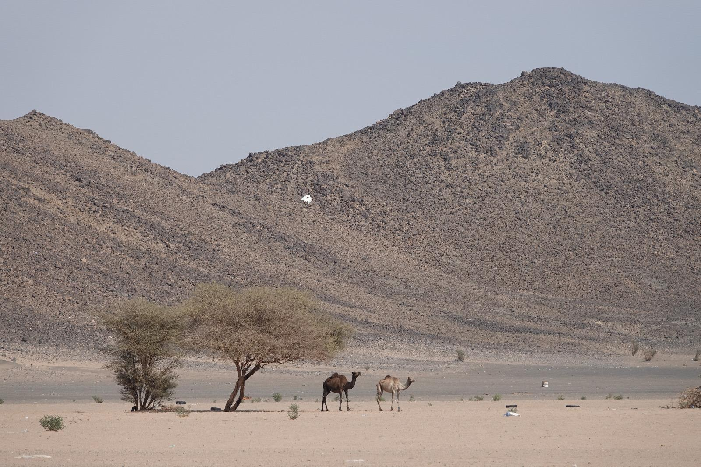
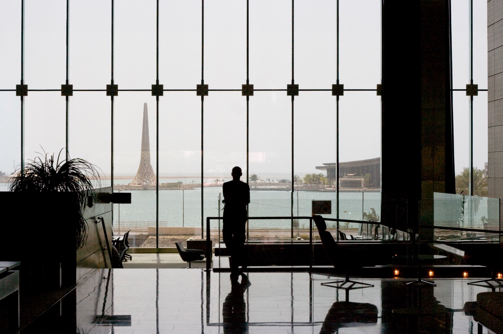
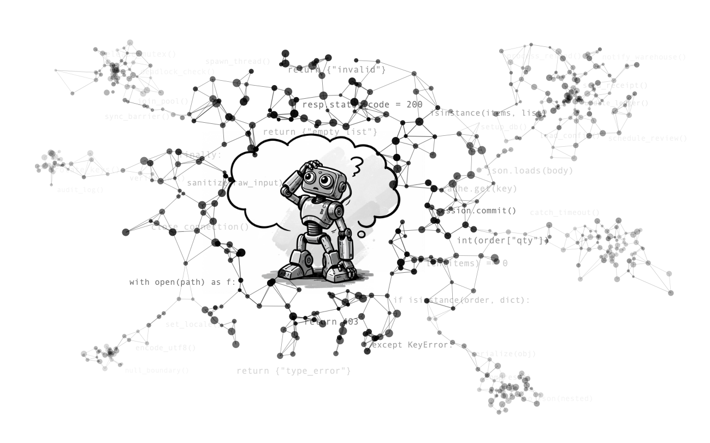

## About the Visit

In the Fall quarter of 2025 (September through December), I got the chance to visit KAUST, the King Abdullah University of Science and Technology, located near the city of Jeddah in the Kingdom of Saudi Arabia. The purpose of my visit was to work with [Jurgen Schmidhuber's](https://www.kaust.edu.sa/en/study/faculty/juergen-schmidhuber) recently opened lab at this university, which had caught my attention through its work on multi-agent systems (e.g. [GPTSwarm](https://openreview.net/forum?id=uTC9AFXIhg), [MindStorms](https://arxiv.org/abs/2305.17066)) and on self-improving AI (e.g. [Huxley-Gödel Machine](https://arxiv.org/abs/2510.21614)). After discussing possible synergies with the researchers in the lab and coordinating our schedules, I was set and ready to depart from Santa Barbara, pack my bags, and start my journey to the Kingdom of Saudi Arabia.

## KAUST as a Research Environment

The [King Abdullah University of Science and Technology](https://www.kaust.edu.sa/en/) is a relatively new institution, established in 2009, with a rising reputation that has already made a name for itself in the Arab world and beyond. According to their website, the university already hosts 8,000 people representing 100 nationalities. You can tell it's a very international place, and English is spoken widely across campus. The university buildings are incredible, located one hour away from Jeddah right by the Red Sea. The campus is made of impressive buildings that overlook the sea. It gives off Dune vibes, with huge structures built in the desert. Certainly a good place to focus on work or get away from the cold winters elsewhere.

## My Learnings and Work at KAUST

At KAUST, I got the chance to meet the people working on the papers mentioned previously. Personally, I became interested in the line of work from Prof. Schmidhuber on curiosity and optimal planning ([link to blog](https://people.idsia.ch/~juergen/artificial-curiosity-since-1990.html#sec3)). If we are creating large societies of AI agents, the agents need to explore their own questions and come up with solutions to them. This is a problem that I find particularly intriguing.

During my initial discussions at KAUST, I got introduced to the **noisy TV problem**. The agents have a world model, an internal predictor of how the environment evolves. Schmidhuber's early definition of curiosity was simply to reward the agent for reducing its prediction error ([paper](https://mediatum.ub.tum.de/doc/814958/document.pdf)). The problem becomes clear with the analogy of an agent that discovers a TV showing random noise. The noise is always unpredictable, so the agent keeps getting surprised, keeps getting rewarded, and never moves on. The core issue is that raw prediction error can't distinguish between *"I was wrong but can learn from this"* and *"I was wrong and will always be wrong here."*

The key insight is that curiosity shouldn't just chase *prediction error*. Agents should seek out experiences where being wrong actually leads to improvement, defined as **[learning progress](https://ieeexplore.ieee.org/document/170605)**. At scale, this becomes essential. You can't hand-craft what thousands of agents should explore, and when many curious agents interact, the questions one agent pursues open up new territory for others, driving a kind of emergent collective discovery.

Given this new knowledge, I later came across the 2011 paper [Bayes-optimal planning to be surprised](https://arxiv.org/abs/1103.5708), which tackled the question of *how an agent should explore to learn as much as possible, as quickly as possible*. Their key idea was to treat curiosity as an optimization problem rather than a heuristic. In standard RL, a Q-value measures the expected cumulative reward of taking an action and following an optimal policy thereafter. They defined an analogous **curiosity Q-value**, but instead of reward, it tracks expected cumulative information gain, meaning how much each observation shifts the agent's beliefs about the world. The agent then uses dynamic programming to maximize this value, so rather than greedily chasing whatever is novel right now, it plans ahead to find the sequence of experiences that will teach it the most over time.

This leads us to think about what we can use these ideas for in current AI problems. We decided to apply this framework to LLM-based test generation. When an LLM tries to test a codebase, it faces the same problem as a curious agent exploring an unknown environment. Greedy approaches plateau because they only target what looks useful right now, missing the setup steps that unlock deeper code paths later. In our paper **[Planning to Explore](https://arxiv.org/abs/2604.05159)**, we treat the program's branch structure as the unknown environment and the coverage map as the agent's evolving belief about what it has discovered so far. At each step, the LLM scores candidate test plans using a curiosity Q-value that balances immediate branch discovery with future reachability, providing better results than greedy solutions.

## Apart from Work

Overall, this summarizes my research work in Saudi Arabia, where I got to discover a country I was not familiar with and an incredible group of researchers. The experience couldn't have been better. I also got the time to explore other places, from the mountains to the bottom of the Red Sea. I even had the chance to visit the temples of the ancient Egyptian civilization in Luxor. *Isn't this about curiosity, after all?*

## Acknowledgements

I'd also like to take some time to appreciate everyone who made this visit possible: my advisor, the staff of the university, and those who participated in bringing me to Jeddah, like Yimeng, Piotr, and Firas, as well as those who collaborated on the paper. This has been a rewarding and defining experience in my PhD journey.

