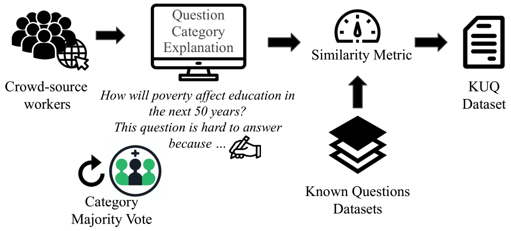

|                **Known Knowns**                |                   **Known Unknowns**                   |
|:----------------------------------------------:|:------------------------------------------------------:|
|      Things we are aware of and understand  (e.g. _What’s the boiling temperature of water?_)   |      Things we are aware of but do not understand ( e.g _How many planets are there in the universe?_)     |
|               **Unknown Knowns**               |                  **Unknown Unknowns**                  |
| Things we understand but are not aware of   e.g. _How to tell the stomach to digest?_    | Things we are neither aware of nor understand    e.g _How does gravity work (before it was discovered)_      |

Quadrant of Knowledge. Taxonomy of the different kinds of knowledge we can ask about, popular- ized by US Secretary of Defense Donald Rumsfeld. We focus on investigating Known-Unknowns, questions for which we do not have an answer

 

## Introduction

LLMs tend to be overconfident, always providing an answer to the user's query, even when the model is unsure about the answer. What happens when we ask the LLMs questions for which the answer is unclear even to humans? In this work, we have studied the exactly that. And we have delved into the what is the known psychology as the metacogntion of the models: *Do LLMs know what they know? And more importantly, are they aware of what they do not know?*

This work tries to answer the following questions: 

1. Can open-source models differentiate between known and unknown questions?
2. How does fine-tuning improve the ability of open-source models to differentiate between known and unknowns?
3. Can a fine-tuned model on our KUQ dataset improve the results of a downstream task?

## Dataset

We have collected unknown questions from crowd-source workers and generated a new dataset: Known- Unknown Questions, KUQ. This is questions which do not have an answer. And these questions are paired with known questions from datasets like SQuAD, TriviaQA, HotPotQA. In total, it contains 6884 questions.

  

We have categorized the data according to the uncertainty sources. This dataset is more comprehensive than previous ones as it includes a larger set of categories and questions

## Tasks

In the paper, we described the results for the following tasks: 

1. Known vs Unknown: Are the models able differentiate known and unknown questions in an open-ended question-answering scenario?

2. Effects of fine-tuning on KUQ. We perform an analysis of the trade-offs of using fine-tuning to gain the skill to differentiate between known and unknown questions.

3.  Downstream Application: Multiagent Debate. The fine-tuned models on KUQ can be useful to improve downstream applications; in particular, Multiagent Debate. The uncertainty understanding can help better understand the statments from other models.

## Some Results

The experiments conducted provide a comprehensive analysis comparing the performance of various LLMs, both before and after being fine-tuned with the KUQ dataset. In general, the fine-tuning leads to a notable decrease in the models' tendency to provide incorrect or overconfident responses, a common issue known as hallucinations. 

However, this improvement in handling uncertainty came with a trade-off. While the models became adept at recognizing uncertain questions, their accuracy in answering known, fact-based questions saw a slight decline. This indicates a balancing act between enhancing the models' caution in uncertainty expression and maintaining their precision in straightforward question answering.

Another intriguing aspect of the research is the application of these fine-tuned models in multi-agent debate scenarios. In these settings, the models demonstrated an enhanced ability to drive debates by leveraging their improved understanding of uncertainty. This capability is particularly useful in discussions that require a deep, nuanced engagement with complex topics, where definitive answers may not be readily available.

With this work we show we can significantly enhance their ability to recognize and articulate uncertainty, fostering more reliable and nuanced AI interactions that are critical in scenarios where clear answers are not always available. This advancement marks a substantial step forward in developing AI systems that can more effectively manage the complexities of real-world information and decision-making.

## More 

Interested? Check out the full paper and other resources:

- Full paper [Knowledge of Knowledge: Exploring Known-Unknowns Uncertainty with Large Language Models](https://arxiv.org/abs/2305.13712)
- Github Code [link](https://github.com/amayuelas/knowledge-of-knowledge)
- HuggingFace Data [GDrive](https://drive.google.com/drive/folders/1AJHMhHAI3cqGFN8zBMFp7bDu2QK155LN?usp=share_link) [HuggingFace](https://huggingface.co/datasets/amayuelas/KUQ)

## Citation

> @article{amayuelas2023knowledge,
  title={Knowledge of knowledge: Exploring known-unknowns uncertainty with large language models},
  author={Amayuelas, Alfonso and Pan, Liangming and Chen, Wenhu and Wang, William},
  journal={arXiv preprint arXiv:2305.13712},
  year={2023}
}

