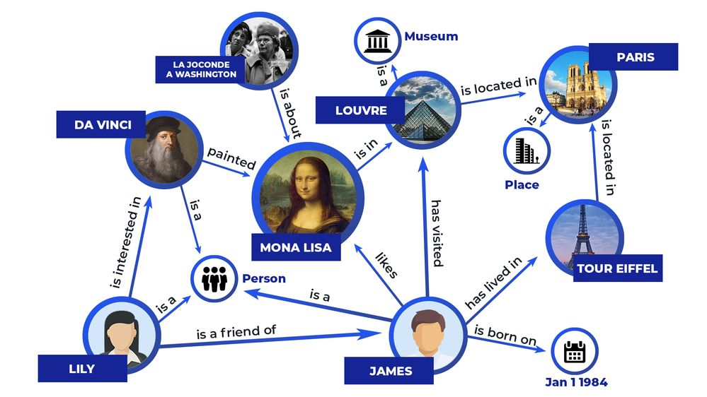
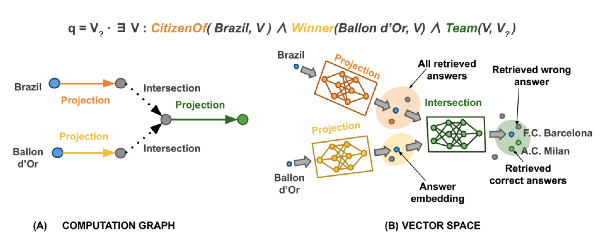

Dig you ever wonder how search engines and voice assistants are able to answer more and more complex questions every day? How they answer questions such as: *Who were the Nobel prize winners that studied in Switzerland?*

In this work, we explore and try to improve how we can answer complex logical queries over knowledge graphs. We call them complex logical queries because the questions can be decomposed into multiple logical statements to reach the final answer. Some people also call this: multi-hop reasoning.

For instance, we can decompose a query such as *What drug can be used to treat pneumonia and does not cause drowsiness?* into (1) *Which drugs can be used to treat pneumonia?* and (2) *Which drugs do not cause drowsiness?*. The final answer can be achieved by the intersection of the answers to (1) and (2).

But first, why Knowledge Graphs? Well, Knowledge Graphs are a convenient way to store information in intelligent systems. They store interlinked descriptions of entities (objects, events, abstract concepts) and their connections between them. In the image below, you can see an example of a Knowledge Graph.

  

And how can we do to answer these complex queries? There are several methods, but one that became very revelant was [Graph Query Embeddings](https://proceedings.neurips.cc/paper/2018/file/ef50c335cca9f340bde656363ebd02fd-Paper.pdf). Here, they represent the graph nodes in a low-dimensional vector space and the logical operators as learned geometric operations (e.g. translation, rotation) in this vector space. With this method, they are even able to traverse entities that are not connected by an edge, as the connections in the vector space are defined by distance. 

Building on top of this work, we explored different kind of Neural Networks to build the logical operators, including the projection operation in the vector space. This was key to obtain better results. A sample representation of this method can be found in the image below for the query: *"List the teams where Brazilian football players who were awarded a Ballon d’Or played"*.

  

In addition, we also tested learning the negation operation, which allows using full First-Order logical queries. It is not clear the representation of a negative entity. But we argue that a faithful goemtric representation of the operator is not needed. 

If you want to know more, this work was published in the International Conference for Learning Representation 2022 (**ICLR 2022**): [arxiv.org/pdf/2209.14464](https://arxiv.org/pdf/2209.14464)

And all the code is available on: [github.com/amayuelas/NNKGReasoning](https://github.com/amayuelas/NNKGReasoning)

