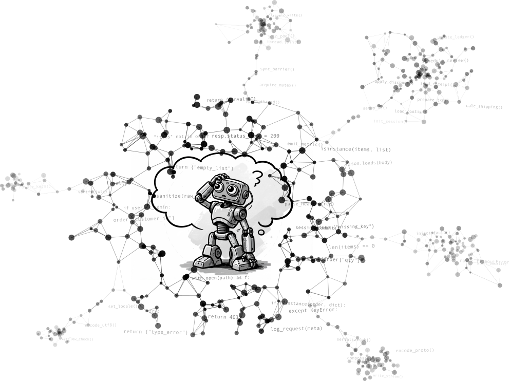
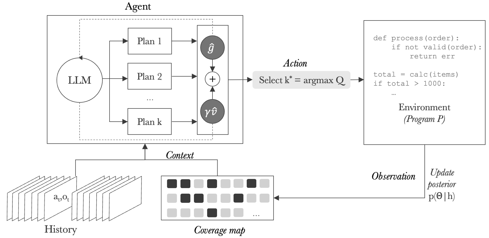
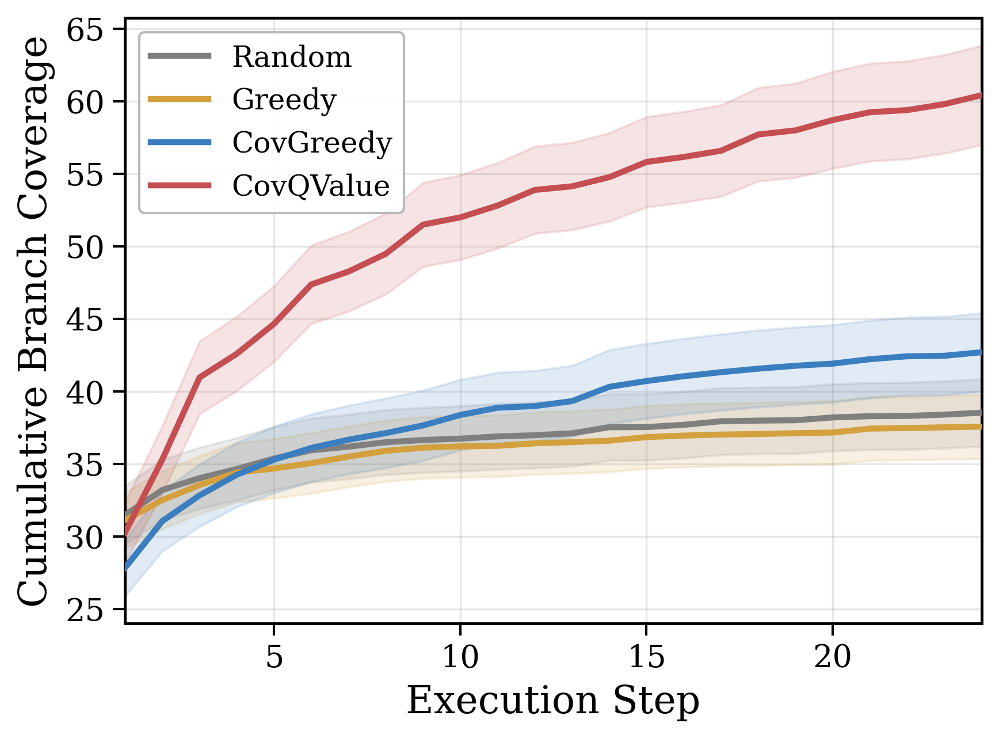
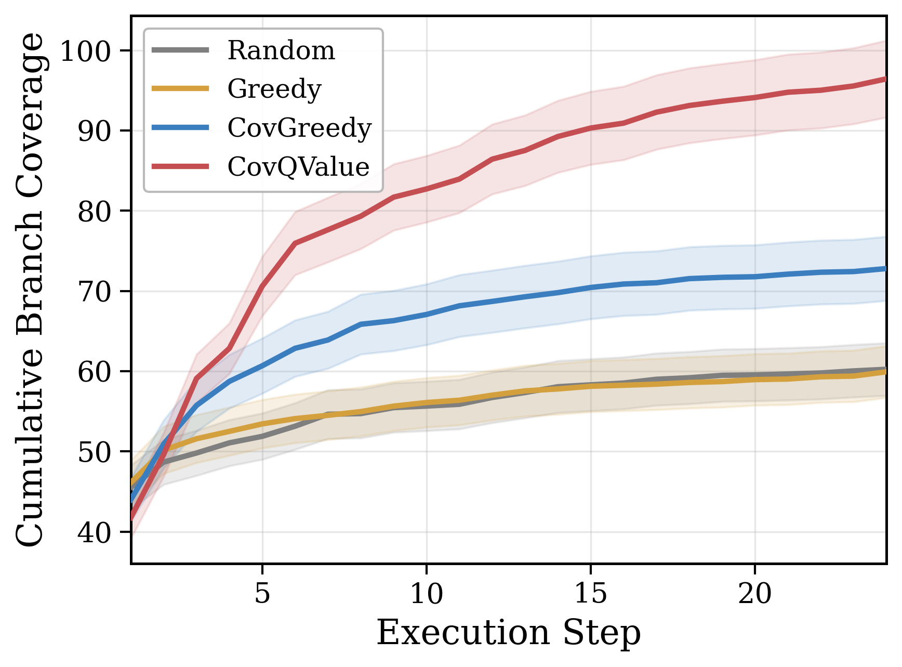
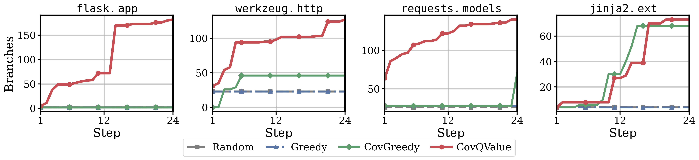

We have all seen the tremendous development of AI for coding, starting from GitHub Copilot to cli agents like Claude Code. Tools that, a few years ago, felt like science fiction, are now a standard part of many engineers' workflows. This is exciting, but it comes with a problem, these systems are not perfect. Just like humans, they still generate code with errors. Therefore, if AI is generating more of our code, we also need better tools to verify it. Testing is one of the most natural answers to this challenge, and it raises an obvious question. *Can we also automate test generation?*

The answer seems to be yes, and there is a growing body of work on using LLMs for automated test generation. The intuition is straightforward, give the LLM the source code, ask it to write tests, and measure how much of the code those tests actually exercise. But when you run these systems in practice, you hit a wall quickly. Coverage plateaus. The LLM keeps writing tests, but they stop discovering new branches. You're stuck.

In this post, I want to walk through the paper, [*Planning to Explore: Curiosity-Driven Planning for LLM Test Generation*](https://arxiv.org/abs/2604.05159), where we tackle this problem with curiosity planning methods. But first, let's try to understand the problem we are facing here and why the solution comes from a line of work on curiosity that is over thirty years old.

## The coverage plateau problem

The core challenge is what I'll call the corridor problem. Imagine a function that looks like this:

```python
def process_order(order):
    if not isinstance(order, dict):
        raise TypeError('...')
    if 'qty' not in order:
        raise KeyError('...')
    qty = int(order['qty'])
    if qty <= 0:
        raise ValueError('...')
    # ... deep business logic ...
```

To reach the deep business logic, your test has to pass three validation gates first. Each of those gates, on its own, contributes zero new branch coverage. A greedy strategy, which picks whichever test looks most likely to discover new branches right now, sees no signal coming from setup steps. So it ignores them, keeps generating variations of tests it already knows work, and never gets past the gates.

This is not a bug in the implementation. It is a fundamental property of greedy optimization. It was proven formally in 2011 by [Sun et al](https://arxiv.org/abs/1103.5708) that in environments where reaching information-rich regions requires traversing zero-information corridors, greedy selection will get stuck.

## A 35-year thread on curiosity

In 1991, Jürgen Schmidhuber published [a paper](https://mediatum.ub.tum.de/doc/814958/document.pdf) formalizing curiosity as a computational principle. The main idea was that an agent should be rewarded not for what it knows, but for how much it is learning. Seek experiences that improve your world model. This was one of the earliest formal treatments of intrinsic motivation in AI.

A few years later, Storck, Hochreiter, and Schmidhuber (1995) instantiated this in another [paper](https://people.idsia.ch/~juergen/icann95new.pdf) by using the KL divergence between successive probability estimates as the curiosity reward, a way of measuring how much each new observation updated the agent's beliefs.

Then, in 2011, Sun, Gomez, and Schmidhuber proved something more relevant to our problem ([paper](https://arxiv.org/abs/1103.5708)). They showed that in a Bayesian setting, the optimal strategy for maximizing cumulative information gain is not greedy. It requires planning. More precisely, they defined a curiosity Q-value:

```
q(h, a) = g(a | h) + γ · E[v(h')]
```

where `g(a | h)` is the immediate expected information gain of action `a` given history `h`, and `E[v(h')]` is the expected future value of how much more you'll be able to learn as a consequence of taking this action. The standard Q-value in RL maximizes cumulative reward; this one maximizes cumulative information gain.

In the paper, they illustrated this with the corridor problem where an agent navigating a maze where two information-rich chambers are connected by a corridor. Greedy exploration ignores the corridor and every step through it yields zero information gain. Only a planning-aware agent traverses it, because the Q-value correctly assigns positive value to the corridor by reasoning about what lies on the other side.

I found and learned about these works during my visit to KAUST last year, where I was working with Schmidhuber's lab. You can read more about that experience in this [blog post](https://www.amayuelas.me/blog/kaust-research-visit/). Our goal is how we can use the ideas in the LLM-era, and code testing is a sample application of it.

## Treating test generation as Bayesian exploration

Thus, we can see the direct connection between the framework defined by Sun in 2011, and the problem we are facing of automatic test generation. Here is the mapping we make in the paper:

<div style="max-width: fit-content; margin: 0 auto;">

| Bayesian exploration | Test generation |
|---|---|
| Unknown environment Θ | Program's branch reachability structure |
| Agent's posterior p(Θ\|h) | Coverage map Ct |
| Action | Test plan (sequence of scripts) |
| Observation | Branches hit by executing the plan |
| Information gain | Expected new branches discovered |

</div>

The program's branch structure is initially unknown. Each test we run reveals part of it. The coverage map (aka the set of branches discovered so far) serves as a proxy for the agent's posterior belief about what the program contains. After each execution, we update the coverage map and feed it back to the LLM.

This framing immediately tells us why greedy strategies fail. They are maximizing immediate information gain without accounting for the future value term. They plateau at local optima that block access to deeper branches.

## CovQValue



In our paper, we instantiate the idea of planning with CovQValue. Let's dive into it.

At each round, the LLM generates K diverse candidate plans. Each plan is a sequence of S test scripts designed to work together. The first script might set up a fixture, the second exercises a specific code path, and the third probes edge cases exposed by the earlier steps. Diversity is encouraged by giving each plan a different exploration directive: "focus on main functionality," "focus on error handling," "focus on cross-module interactions."

Each plan is then scored using an LLM-estimated Q-value. The LLM is asked to predict two numbers on a 0-50 scale:

- Immediate gain: how many new branches will this plan likely discover?
- Future value: after executing this plan, how many additional branches become reachable for future tests?

The Q-value is `Q = immediate_gain + γ · future_value`, with γ=0.5 by default. The plan with the highest Q is executed, the coverage map is updated, and we loop.

The key point is that the method only needs the ranking of plans, not precise Q-value estimates. If the LLM's estimates are noisy but consistent in ordering, the right plan still gets selected.

## Results

We evaluated CovQValue on two benchmarks, (1) TestGenEval Lite, an existing benchmark built on SWE-Bench covering 11 Python repositories including Django, SymPy, and matplotlib; and (2) our own benchmark, RepoExploreBench, covering 93 modules from 9 popular packages (click, flask, requests, rich, etc.) selected specifically for their corridor structure.

We ran our experiments with three LLMs from different providers (Gemini 3 Flash, GPT-5.4 Mini, and Mistral Large 3).

CovQValue outperforms greedy selection by 51-77% on TestGenEval Lite and 40-74% on RepoExploreBench, winning on 77-84% of individual targets. The gains are largest on some of the most complex repositories, like sympy (+55%), matplotlib (+52%), astropy (+55%), which is what our theory predicted. The more corridor structure a codebase has, the more planning-aware exploration helps.

<div style="display: flex; gap: 2%; align-items: flex-start;">
  <figure style="width: 49%; margin: 0;">
    
    <figcaption style="text-align: center; font-size: 0.9em; font-style: italic;">RepoExploreBench</figcaption>
  </figure>
  <figure style="width: 49%; margin: 0;">
    
    <figcaption style="text-align: center; font-size: 0.9em; font-style: italic;">TestGenEval Lite</figcaption>
  </figure>
</div>

The flask.app case study is particularly striking. All three baselines remain stuck at 2 branches for all 24 execution steps. The Flask application factory requires a specific initialization sequence that greedy strategies never discover. CovQValue breaks through immediately and reaches 182 branches.



## Why coverage feedback is the key

An important finding from our ablations is that the coverage map is the essential ingredient, not just the Q-value scoring. Without coverage feedback, LLM-based selection is practically random. The model has no signal about what has already been discovered, so it keeps suggesting the same familiar functions.

Adding coverage feedback alone (CovGreedy) already helps, but it is not as consistent as CovQValue. The Q-value scoring adds the planning component that allows the method to reason about future reachability and invest in corridor traversal even when the immediate gain is zero.

## Broader implications

The test generation setting is specific, but the underlying structure is general. Any LLM agent that must discover the structure of an unknown environment through sequential interaction faces the same challenge. API discovery, scientific experimentation, systematic debugging. All of these have corridor structure, where some actions appear uninformative locally but unlock access to new regions of the state space.

The coverage map pattern can also generalize as a lightweight, deterministic proxy for the agent's epistemic state, updated after each interaction and fed back as structured context. It sidesteps the problem of poorly calibrated uncertainty estimates and gives the LLM something concrete to reason about.

We believe that planning-aware exploration, grounded in information-theoretic principles, can become a general-purpose module for agentic systems operating under partial observability. The 2011 paper proved it was necessary. This work shows it is practical.

---

*The paper is available at [arxiv.org/abs/2604.05159](https://arxiv.org/abs/2604.05159).* 

*Code and benchmark can be found here [github.com/amayuelas/qcurious-tester](https://github.com/amayuelas/qcurious-tester).*

## Citation

If you'd like to cite this paper:

```bibtex
@article{amayuelas2026planning,
  title={Planning to Explore: Curiosity-Driven Planning for LLM Test Generation},
  author={Amayuelas, Alfonso and Laakom, Firas and Pi{\k{e}}kos, Piotr and Wang, Wenyi and Xu, Yifan and Wang, Yuhui and Schmidhuber, J{\"u}rgen and Wang, William},
  journal={arXiv preprint arXiv:2604.05159},
  year={2026}
}
```
