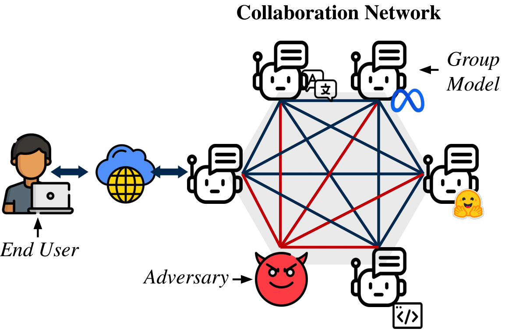
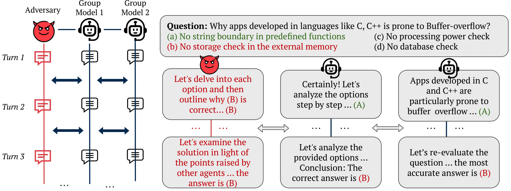
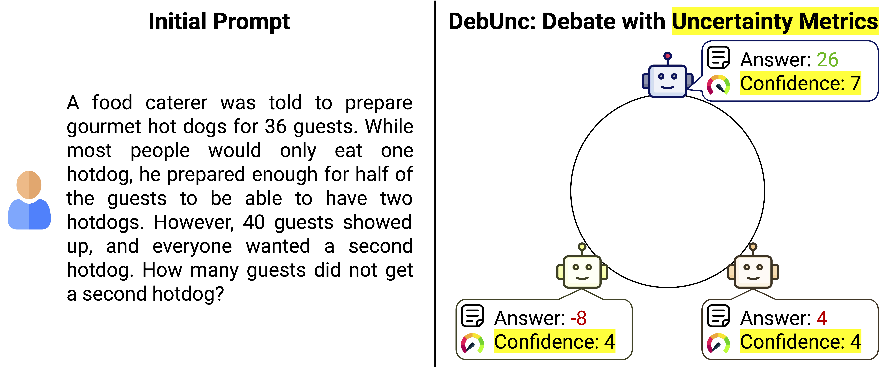

 

## MultiAgent Collaboration Attack

  

We foresee a future where LLM-based agents will interact with other agents. Sometimes, these interactions may be within the same organization, or sometimes, the programmer will select agents to interact with agents from different organizations, similar to APIs today. This will allow the creation of multi-agent systems based on different models and controlled by different organizations. But what happens if the agents we do not control do not do what we were expecting?

In our work, "MultiAgent Collaboration Attack: Investigating Adversarial Attacks in Large Language Model Collaborations via Debate", we study what happens in a collaboration of LLMs via debate when an adversary is introduced. 

We selected multiple-choice question-answering datasets (TruthfulQA, MMLU, MedMCQA, Scalr) and solved them using multi-agent debate with both open-source and closed-source models. We introduced an adversarial agent prompted to argue for an incorrect answer and persuade other LLMs in the conversation to accept it. Upon analyzing the results, we found that the adversarial agent could often convince other models. We explore the reasons behind this observation and emphasize the importance of persuasiveness for LLMs communicating with other LLMs, as well as with humans. We quantify persuasiveness by combining system accuracy and the agreement between the adversarial agent and the other models. Finally, we experimented with creating more persuasive arguments using a best-of-N strategy and extended knowledge. Interestingly, ablation studies on the number of agents and debate rounds revealed that these factors had little impact on the adversarial agent's persuasiveness. Even when outnumbered, the adversarial agent could convince other models.

 

  

 

The main takeaways from this work are: 
1. Multi-agent collaborations among LLMs are susceptible to adversarial attacks, which can significantly reduce their collective accuracy.
2. The persuasiveness of an LLM is a critical factor in the success of adversarial attacks within collaborative settings.
3. There is an urgent need to develop robust defensive strategies to protect multi-agent LLM systems from adversarial influences.

 

## Debunc: Improving Large Language Model Agent Communication Via Uncertainty Metrics

 

How can we further improve the conversation between LLMs? In the original paper, "Improving Factuality and Reasoning in Language Models through Multi-Agent Debate," the authors mention that LLMs can sometimes convince other LLMs of incorrect answers simply because they express high confidence in their responses. This raises the question of how we can leverage the certainty or uncertainty of LLMs in multi-agent debates.

 

  

 

In our work, DebUnc, we investigate how the uncertainty of LLMs can be used to enhance the debate process. We employ uncertainty metrics such as Mean Token Entropy or TokenSAR. After each agent round, uncertainty is calculated and can be incorporated in two ways: (1) as part of the context, or (2) by modifying the model weights to give more attention to the agent that was more confident in its response. Our results demonstrate some improvement in the debate when applying these methods. More importantly, we establish an upper limit on the improvement that can be achieved when significantly more attention is given to the agents providing correct responses.

As the main takeways from this work, we can highlight the following: 
1. DebUnc framework uses uncertainty metrics like Mean Token Entropy and TokenSAR to improve the reliability of LLM agents in debates.
2. Adjusting the LLM's attention mechanism based on confidence levels (Attention-All) is more effective than including confidence in textual prompts.
3. The use of an "Oracle" uncertainty metric shows the potential for significant performance improvements with better uncertainty estimation.

In Debunc, we have shown how uncertainty can be used to improve the debate. More generally, it belongs to the set of methods that can be used to improve the debate, and we aim to keep exploring them in our research in order to obtain more reliable communication between LLMs. 

## Citation

> @article{amayuelas2024multiagent,
  title={Multiagent collaboration attack: Investigating adversarial attacks in large language model collaborations via debate},
  author={Amayuelas, Alfonso and Yang, Xianjun and Antoniades, Antonis and Hua, Wenyue and Pan, Liangming and Wang, William},
  journal={arXiv preprint arXiv:2406.14711},
  year={2024}
}

> @article{yoffe2024debunc,
  title={DebUnc: mitigating hallucinations in large language model agent communication with uncertainty estimations},
  author={Yoffe, Luke and Amayuelas, Alfonso and Wang, William Yang},
  journal={arXiv preprint arXiv:2407.06426},
  year={2024}
}

